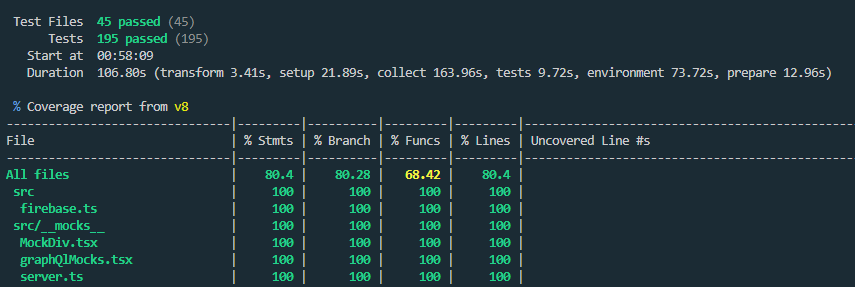

# Next.js Firebase App REST/GraphiQL Client

This application is developed using Next.js (App Router) and Firebase for user authentication. It has been designed as a multifunctional platform for working with APIs, providing users with the ability to utilize both the GraphQL Client and the REST Client.

## Installation and Setup

### 1. Cloning the Repository

Clone the repository to your local machine:

`git clone https://github.com/HunterTigerX/graphiql-app.git`
`cd graphiql-app`

### 2. Installing Dependencies

Install the required dependencies:

`npm install`

### 3. Setting Up Environment Variables

Create a file named `.env.local` in the root of the project and add the environment variables from the `.env.test` file:

`NEXT_PUBLIC_FIREBASE_API_KEY=your_api_key
NEXT_PUBLIC_FIREBASE_AUTH_DOMAIN=your_auth_domain
NEXT_PUBLIC_FIREBASE_PROJECT_ID=your_project_id
NEXT_PUBLIC_FIREBASE_STORAGE_BUCKET=your_storage_bucket
NEXT_PUBLIC_FIREBASE_MESSAGING_SENDER_ID=your_messaging_sender_id
NEXT_PUBLIC_FIREBASE_APP_ID=your_app_id`

### 4. Project Launch

Launch the project in development mode:

`npm run dev`

Now open your browser and go to [http://localhost:3000](http://localhost:3000).

## Project Structure

- **src/** - Source code of the application
- **src/firebase.js** - Firebase configuration
- **app/** - Application pages

### 5. Running Tests and Test Coverage

`npm run test` - for tests
`npm run coverage` - for test coverage

